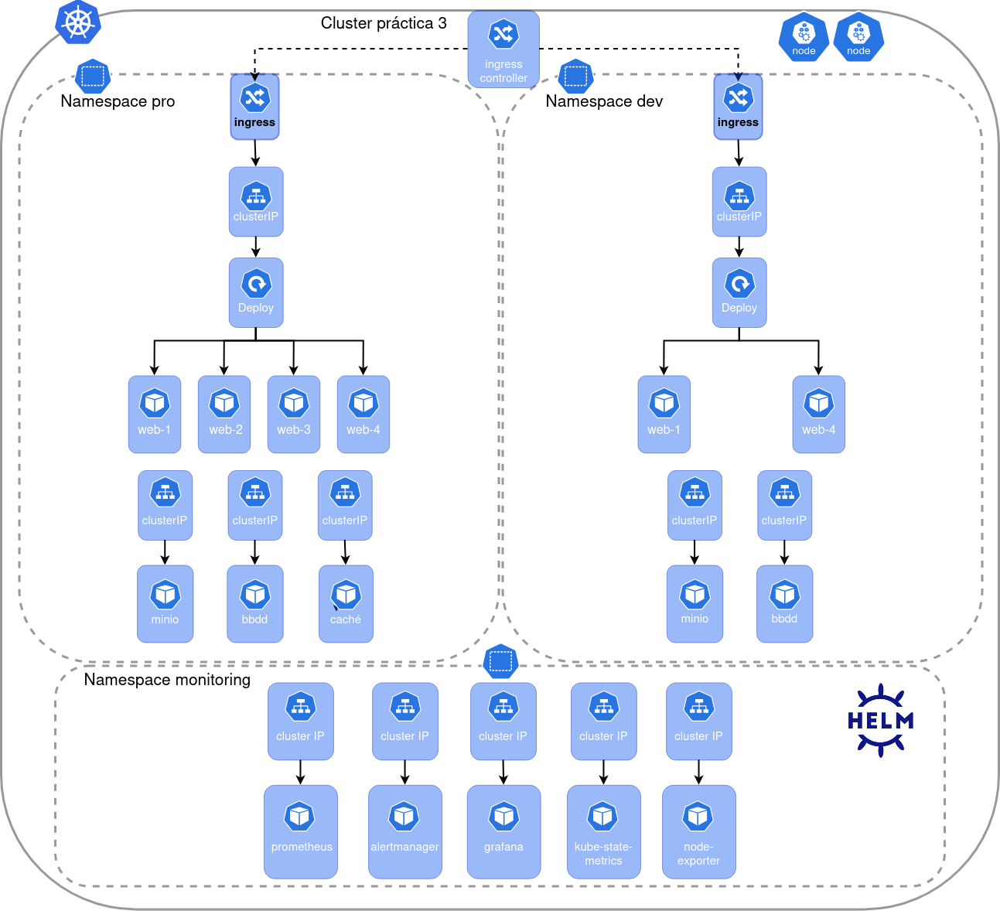

# Práctica 3 – Kubernetes en local (k3d)

En este proyecto se despliega una aplicación web (Flask) sobre **Kubernetes** en local usando **k3d**, con dos entornos diferenciados:

- Entorno de **desarrollo (dev)**.
- Entorno de **producción (pro)**.

Además, se despliega un namespace adicional para **monitorización (monitoring)**.

Incluye:

- Aplicación web con alta disponibilidad:
  - **2 réplicas en dev**
  - **4 réplicas en pro**
- Base de datos **MySQL** en dev y pro.
- Caché **Redis** en pro (solo entorno pro).
- Almacenamiento de ficheros estáticos compartidos con **MinIO** (dev y pro).
- **Ingress** por entorno y resolución DNS local vía `/etc/hosts`.
- Monitorización con **Prometheus**, **Grafana**, **Alertmanager** y un **dashboard** por entorno.
- Health-checks y probes:
  - Liveness: `/live`
  - Readiness: `/ready` (pro) y `/health` (dev)
  - Health para tests: `/health`

---

## Instalación y ejecución de los entornos

### Requisitos

Antes de comenzar, hay que tener instalados:

- Docker Engine
- kubectl
- k3d
- Helm
- make

Comprobación rápida:

```bash
docker --version
kubectl version --client
k3d version
helm version
make --version
```

### Clonar el repositorio
```bash
git clone https://github.com/VicenteOgazon/Practica-3-k8s.git
cd Practica-3-k8s
```

### Para poder entrar utilizando los ingress se debe añadir en /etc/hosts:
```bash
127.0.0.1 app.dev.localhost
127.0.0.1 app.pro.localhost
127.0.0.1 monitoring.localhost
```
### Crear ficheros de variables (secrets)

Los secretos se gestionan como Secrets de Kubernetes, pero los valores sensibles se guardan en ficheros .env locales que no se suben al repositorio, por ello hay que crearlos en tu máquina local:
```bash
- dev/dev.env
- pro/pro.env
- monitoring/monitoring.env
```
Estos ficheros son necesarios para ejecutar make apply-dev, make apply-pro y make monitoring-install.

### Crear el clúster k3d
```bash
make cluster-create
```

### Construir e importar las imágenes al clúster
```bash
make build-dev
make build-pro
```

### Desplegar dev y pro
```bash
make apply-dev
make apply-pro
```

### Desplegar monitorización
```bash
make monitoring-install
make monitoring-dev
make monitoring-pro
```
#### Acceso a los servicios

Aplicación web (dev):

- http://app.dev.localhost/

Aplicación web (pro):

- http://app.pro.localhost/

Grafana (monitoring):

- http://monitoring.localhost/

---

## Descripción de los entornos

### Entorno de desarrollo
El entorno de desarrollo está pensado para facilitar la programación, las pruebas y la depuración de la aplicación manteniendo una arquitectura similar a producción, pero más sencilla y sin requisitos estrictos de alta disponibilidad.
A diferencia del entorno de producción, en desarrollo se despliegan menos réplicas de la aplicación y no se utiliza Redis como caché, centrándose en comprobar la lógica de la aplicación, el acceso a la base de datos y la integración con la monitorización.

Características entorno de desarrollo (Kubernetes dev):

- Se despliegan dos instancias de la aplicación Flask (Deployment `dev/web` con 2 réplicas) expuestas mediante Ingress (`app.dev.localhost`).
- La aplicación se configura con `APP_ENV=development` para no utilizar la caché (Redis no se despliega en dev).
- Incluye una base de datos MySQL específica del entorno de desarrollo (StatefulSet `dev/mysql` con PVC).
- No se incluye Redis como memoria caché (la lógica de caché está deshabilitada por configuración).
- Se despliega MinIO dev con un bucket `static-dev`, desde el que la aplicación consume ficheros estáticos compartidos, en este caso el fondo de la web.
- Se implementan endpoints de salud y probes:
    - Liveness: `/live`
    - Readiness/Health: `/health` (en dev la disponibilidad depende de la BD)
- La monitorización está activa en el stack común (namespace `monitoring`):
    - Prometheus scrapea métricas de la aplicación (`/metrics`) mediante un `ServiceMonitor` para dev.
    - Grafana permite visualizar CPU, memoria y métricas HTTP de los pods del `entorno dev` mediante un dashboard específico.
    - Alertmanager evalúa reglas de alerta para disponibilidad del Deployment `dev/web`.

### Entorno de producción
El entorno de producción está diseñado para ejecutar la aplicación en un entorno más robusto, con alta disponibilidad, caché y alertas configuradas.
En este caso se despliegan 4 réplicas de la aplicación, se habilita Redis como caché y se refuerza la monitorización para poder detectar y demostrar fallos de los servicios críticos durante la práctica.

Características entorno de producción (Kubernetes pro):

- Se despliegan cuatro instancias de la aplicación Flask (Deployment `pro/web` con 4 réplicas) expuestas mediante Ingress (`app.pro.localhost`), cumpliendo el requisito de alta disponibilidad.
- La aplicación se configura con `APP_ENV=production` para utilizar la caché (`USE_CACHE=True`).
- Incluye una base de datos MySQL de producción (StatefulSet `pro/mysql` con PVC).
- Se despliega Redis como sistema de caché en memoria (StatefulSet `pro/redis`), y la aplicación lo utiliza cuando está disponible.
- Se despliega MinIO pro con un bucket `static-pro`, desde el que la aplicación consume ficheros estáticos compartidos en producción, igualmente el fondo de la web.
- Se implementan endpoints de salud y probes:
    - Liveness: `/live`
    - Readiness: `/ready` (en pro la disponibilidad depende de la caché)
    - Health: `/health` (pensado para tests, indicando DB y Redis)
- La pila de monitorización también está activa en el stack común (namespace `monitoring`):
    - Prometheus recoge métricas de la aplicación (`/metrics`) mediante un `ServiceMonitor` para pro.
    - Grafana muestra dashboards de rendimiento (CPU, memoria, HTTP req/s, latencia p95, etc.) para los pods del `entorno pro`.
    - Alertmanager recibe alertas definidas en reglas adicionales (por ejemplo, réplicas disponibles del Deployment `pro/web` y disponibilidad de MySQL) y puede enviar notificaciones por correo.

| Característica       | Desarrollo                                              | Producción                                               |
| -------------------- | ------------------------------------------------------- | -------------------------------------------------------- |
| Nº de instancias web | 2 (Deployment `dev/web`)                                | 4 (Deployment `pro/web`)                                 |
| Base de datos        | MySQL dev (StatefulSet `dev/mysql`)                     | MySQL pro (StatefulSet `pro/mysql`)                      |
| Caché Redis          | Deshabilitada (no se despliega)                         | Activada (StatefulSet `pro/redis`)                        |
| Exposición           | Ingress `app.dev.localhost`                             | Ingress `app.pro.localhost`                              |
| MinIO                | Bucket `static-dev` para estáticos de desarrollo        | Bucket `static-pro` para estáticos de producción         |
| Monitorización       | Prometheus + Grafana + Alertmanager (stack común)       | Igual que dev (stack común), con más reglas de alerta |
| Alertas              | Disponibilidad mínima de réplicas web (warning)         | Disponibilidad web (critical) + MySQL pod ready (critical) |
| Objetivo principal   | Desarrollo, pruebas y validación de integración         | Alta disponibilidad, caché, degradación controlada y alertas |

### Estructura del proyecto
```bash
├── app/
│   ├── __init__.py                # create_app(), carga config por entorno, registra rutas y métricas
│   ├── __main__.py                # punto de entrada: python -m app
│   ├── routes.py                  # rutas principales (/, /usuarios/json, /set, /delete, /live, /ready, /health, etc.)
│   ├── cache.py                   # lógica de acceso a Redis (solo pro)
│   ├── config.py                  # clases Config, DevelopmentConfig, ProductionConfig
│   ├── templates/
│   │   ├── index.html             # interfaz principal + popup de errores + estado servicios
│   │   └── status.html            # página de estado
│   └── static/
│       └── style.css              # estilos CSS
│
├── dockerfile/
│   ├── dev_Dockerfile             # imagen Flask para dev
│   ├── pro_Dockerfile             # imagen Flask para pro
│   ├── dev_requirements.txt       # dependencias Python dev
│   └── pro_requirements.txt       # dependencias Python pro
│
├── dev/
│   ├── dev.yaml                   # recursos Kubernetes para dev (namespace + mysql + minio + web + ingress)
│   └── dev.env                    # secrets locales (no versionado)
│
├── pro/
│   ├── pro.yaml                   # recursos Kubernetes para pro (namespace + mysql + redis + minio + web + ingress)
│   └── pro.env                    # secrets locales (no versionado)
│
├── monitoring/
│   ├── namespace.yaml             # namespace monitoring
│   ├── values.yaml                # configuración stack monitoring (grafana ingress, alertmanager, reglas, etc.)
│   ├── monitoring.env             # secrets locales (grafana + smtp) (no versionado)
│   ├── dev-monitoring/
│   │   ├── dev-servicemonitor.yaml
│   │   └── dev-dashboard.yaml
│   └── pro-monitoring/
│       ├── pro-servicemonitor.yaml
│       └── pro-dashboard.yaml
│
├── imports/
│   ├── dev/
│   │   ├── mysql/init.sql
│   │   └── minio/fondo.png
│   └── pro/
│       ├── mysql/init.sql
│       └── minio/fondo.png
│
├── test/
│   ├── local/
│   │   └── test-web.py            # tests locales contra despliegue real (dev/pro)
│   └── unit/
│       └── test-unit.py           # tests unitarios (CI)
│
├── .github/workflows/
│   └── ci.yml                     # pipeline: lint + unit tests + build/push + deploy simulado
│
├── Makefile                       # comandos de despliegue, diagnóstico y tests
└── README.md                      # guía de instalación, explicación y pruebas
```
---

## Diagrama



---
## Pruebas realizadas

### Entorno de desarrollo

Se ha realizado un conjunto de pruebas funcionales y de comportamiento sobre el entorno de desarrollo.  
Todas las pruebas han sido satisfactorias.

| Nº | Descripción de la prueba                                                                                                              | Resultado |
| ---| ------------------------------------------------------------------------------------------------------------------------------------- | --------- |
| 1  | Crear el clúster k3d (`make cluster-create`) y comprobar nodos (`make nodes`)                                                         | OK  ✅    |
| 2  | Construir e importar la imagen dev al clúster (`make build-dev`)                                                                      | OK  ✅    |
| 3  | Desplegar el entorno dev (secret + manifests) (`make apply-dev`)                                                                      | OK  ✅    |
| 4  | Acceso correcto a la aplicación por Ingress dev (`http://app.dev.localhost/`)                                                         | OK  ✅    |
| 5  | La UI muestra el nombre de instancia (pod `web-...`) y al recargar se observa el balanceo entre réplicas (2 pods)                     | OK  ✅    |
| 6  | Operaciones CRUD sobre usuarios (alta, listado, borrado) funcionan contra la base de datos MySQL dev                                  | OK  ✅    |
| 7  | El fondo de la aplicación se carga desde MinIO dev (bucket `static-dev`, objeto `fondo.png`)                                          | OK  ✅    |
| 8  | Readiness/liveness configuradas: los pods web aparecen Ready con DB operativa                                                         | OK  ✅    |
| 9  | Prueba de caída de BD: escalar MySQL a 0 (`make scale-bd-dev n=0`) y comprobar comportamiento de la app (popup y/o error controlado)  | OK  ✅    |
| 10 | Readiness actúa al caer la BD: los pods web pasan a NotReady y dejan de recibir tráfico (`kubectl -n dev get pods -w`)                | OK  ✅    |
| 11 | Recuperación tras restaurar la BD: escalar MySQL a 1 (`make scale-bd-dev n=1`) y comprobar que los pods vuelven a Ready               | OK  ✅    |
| 12 | El endpoint `/health` en dev responde correctamente (200 con DB OK / 503 si no DB) (`make health-dev`)                                | OK  ✅    |
| 13 | Tests locales de integración dev (`make test-local-dev`) verifican: `/health`, conexión a DB (según respuesta de `/health`)           | OK  ✅    |
| 14 | Desplegar monitoring (namespace+helm) (`make monitoring-install`) y aplicar monitoring para dev (`make monitoring-dev`)               | OK  ✅    |
| 15 | En Prometheus, el target de la app dev aparece UP (ServiceMonitor `web-dev`)                                                          | OK  ✅    |
| 16 | En Grafana, el dashboard DEV muestra CPU/memoria/HTTP sobre los pods de la app                                                        | OK  ✅    |
| 17 | Al forzar una reducción de réplicas web (<2), salta la alerta correspondiente y llega un aviso al correo                              | OK  ✅    |

**Conclusión:**
El entorno de desarrollo funciona correctamente con 2 réplicas, acceso por Ingress, base de datos operativa, estáticos servidos desde MinIO, probes configuradas y monitorización/alertas verificadas.

### Entorno de producción

Se ha realizado un conjunto de pruebas para verificar el correcto funcionamiento del entorno de producción, incluyendo el uso de caché con Redis, la alta disponibilidad y la configuración de alertas.

| Nº | Descripción de la prueba                                                                                                                           | Resultado |
| ---| -------------------------------------------------------------------------------------------------------------------------------------------------- | --------- |
| 1  | Construir e importar la imagen pro al clúster (`make build-pro`)                                                                                   | OK  ✅    |
| 2  | Desplegar el entorno pro (secret + manifests) (`make apply-pro`)                                                                                   | OK  ✅    |
| 3  | Acceso correcto a la aplicación por Ingress pro (`http://app.pro.localhost/`)                                                                      | OK  ✅    |
| 4  | La UI muestra el nombre de instancia (pod `web-...`) y al recargar se observa el balanceo entre réplicas (4 pods)                                  | OK  ✅    |
| 5  | Operaciones CRUD sobre usuarios funcionan contra la base de datos MySQL pro                                                                        | OK  ✅    |
| 6  | Caché funcional para lectura: tras cargar usuarios, si cae la BD pero Redis tiene datos, el listado puede responder desde caché                    | OK  ✅    |
| 7  | El fondo de la aplicación se carga desde MinIO dev (bucket `static-dev`, objeto `fondo.png`)                                                       | OK  ✅    |
| 8  | Prueba de caída de Redis: escalar Redis a 0 (`make scale-redis-pro n=0`) y observar efecto en `/health` (cache=false) y en la UI                   | OK  ✅    |
| 9  | Readiness pro: al caer BD y Redis, los pods web pasan a NotReady y dejan de recibir tráfico                                                        | OK  ✅    |
| 10 | Recuperación: restaurar Redis (`make scale-redis-pro n=1`) y/o BD, comprobar que los pods vuelven a Ready                                          | OK  ✅    |
| 11 | El endpoint `/health` en pro responde correctamente (200 si DB y Redis OK / 503 si no hay ni BD ni Redis) (`make health-pro`)                      | OK  ✅    |
| 12 | El endpoint `/ready` en pro refleja el modo degradado (DB OR Redis) y se usa en readinessProbe                                                     | OK  ✅    |
| 13 | Tests locales de integración pro (`make test-local-pro`) verifican: `/health`, conexión a DB y conexión a Redis                                    | OK  ✅    |
| 14 | Aplicar monitoring para pro (`make monitoring-pro`) y validar el ServiceMonitor `web-pro`                                                          | OK  ✅    |
| 15 | En Prometheus, el target de la app pro aparece UP y se observan métricas de pods `web-*`                                                           | OK  ✅    |
| 16 | En Grafana, el dashboard PRO muestra CPU/memoria/HTTP sobre pods de la app (req/s, 5xx, p95)                                                       | OK  ✅    |
| 17 | Al forzar una reducción de réplicas web (<4), salta la alerta correspondiente y llega un aviso al correo                                           | OK  ✅    |
| 18 | Al provocar MySQL no Ready (por ejemplo escalando MySQL a 0), salta la alerta correspondiente y llega un aviso al correo                           | OK  ✅    |

**Conclusión:**
El entorno de producción cumple los requisitos de:
- Alta disponibilidad (4 réplicas web y balanceo por Ingress).
- Redis desplegado y conectividad comprobada.
- Modo degradado controlado mediante readiness (según la lógica definida).
- Monitorización con Prometheus + Grafana y alertas verificadas con reglas específicas de pro.

---
## Resumen de comandos disponibles en el Makefile

Los comandos se deben ejecutar desde la carpeta raíz del proyecto, se pueden consultar todos con el comando help.

```bash
# Cluster (k3d)
make cluster-create                   - Crea el cluster practica3 (2 agents), LB en puerto :80 y monta ./imports en /imports
make cluster-list                     - Lista clusters k3d
make cluster-nodes                    - Lista nodos del cluster k3d
make cluster-start                    - Inicia el cluster practica3
make cluster-stop                     - Para el cluster practica3
make cluster-delete                   - Borra el cluster practica3

# Build e import de imágenes al cluster
make build-dev                        - Build de la imagen app:dev e import al cluster (evita ImagePullBackOff)
make build-pro                        - Build de la imagen app:pro e import al cluster (evita ImagePullBackOff)

# Deploy por entorno (Kubernetes)
make apply-dev                        - Crea/actualiza secret dev-env desde dev/dev.env y aplica manifests DEV
make delete-dev                       - Elimina recursos DEV y borra el secret dev-env (si existe)
make apply-pro                        - Crea/actualiza secret pro-env desde pro/pro.env y aplica manifests PRO
make delete-pro                       - Elimina recursos PRO y borra el secret pro-env (si existe)

# Monitoring (Prometheus / Grafana / Alertmanager)
make monitoring-install               - Crea namespace+secrets y despliega kube-prometheus-stack con Helm
make monitoring-delete                - Desinstala el stack de monitoring y borra el namespace

# Diagnóstico general
make nodes                            - Lista nodos del cluster con IP y roles

# Diagnóstico DEV
make pods-dev                         - Lista pods DEV
make svc-dev                          - Lista Services DEV
make ingress-dev                      - Lista Ingress DEV
make endpoints-dev                    - Lista Endpoints DEV
make rollout-dev                      - Reinicia deployment/web DEV
make scale-web-dev n=<num>            - Escala el deployment web en DEV
make scale-bd-dev n=<num>             - Escala el StatefulSet mysql en DEV
make logs-dev POD=<pod>               - Muestra logs de un pod DEV
make describe-dev POD=<pod>           - Describe un pod de DEV
make events-dev                       - Muestra eventos del namespace dev
make exec-dev POD=<pod>               - Entra en un pod DEV por shell
make curl-dev                         - Curl al host app.dev.localhost
make health-dev                       - GET /health en DEV

# Diagnóstico PRO
make pods-pro                         - Lista pods PRO
make svc-pro                          - Lista Services PRO
make ingress-pro                      - Lista Ingress PRO
make endpoints-pro                    - Lista Endpoints PRO
make rollout-pro                      - Reinicia deployment/web PRO
make scale-web-pro n=<num>            - Escala el deployment web en PRO
make scale-bd-pro n=<num>             - Escala el StatefulSet mysql en PRO
make scale-redis-pro n=<num>          - Escala el deployment redis en PRO
make logs-pro POD=<pod>               - Muestra logs de un pod PRO
make describe-pro POD=<pod>           - Describe un pod de PRO
make events-pro                       - Muestra eventos del namespace pro
make exec-pro POD=<pod>               - Entra en un pod de PRO por shell
make curl-pro                         - Curl al host app.pro.localhost
make health-pro                       - GET /health en PRO

# Diagnóstico MONITORING
make pods-monitoring                  - Lista pods de monitoring
make svc-monitoring                   - Lista servicios de monitoring
make ingress-monitoring               - Lista ingress de monitoring
make endpoints-monitoring             - Lista endpoints de monitoring
make events-monitoring                - Lista eventos del namespace monitoring
make logs-monitoring POD=<pod>        - Logs de un pod de monitoring
make describe-monitoring POD=<pod>    - Describe un pod de monitoring
make exec-monitoring POD=<pod>        - Entra en un pod de monitoring por shell
make pf-prom                          - Port-forward Prometheus a localhost:9090
make pf-alertmanager                  - Port-forward Alertmanager a localhost:9093

# Tests locales (script)
make test-local-dev                   - Ejecuta tests locales contra app.dev.localhost
make test-local-pro                   - Ejecuta tests locales contra app.pro.localhost
